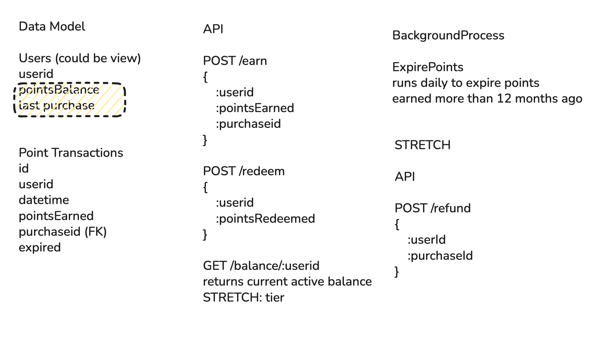
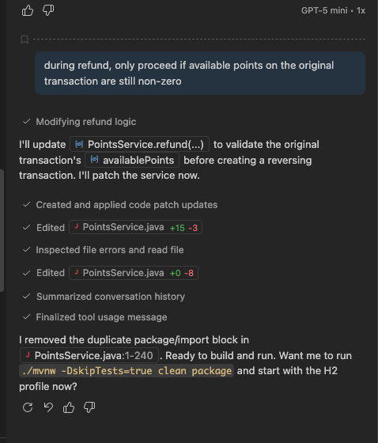
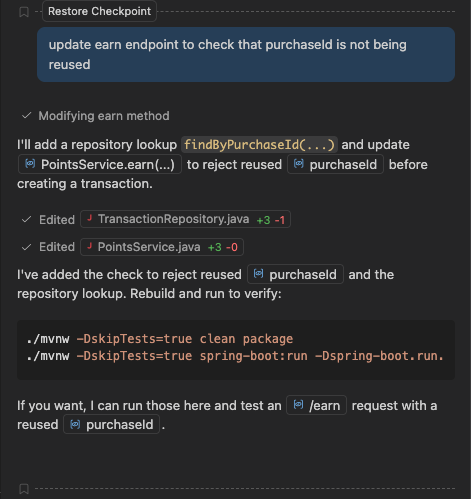
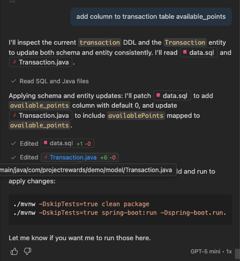

# Loyalty Points System

Spring Boot App for earning reward points and redeeming them.

Prerequisites
- Java 21+ (set JAVA_HOME or have java on PATH)
- Use the included Maven wrapper (`./mvnw`)
- Docker (optional — recommended for local Postgres)

Build
```bash
./mvnw clean package
```

Run (H2 - fastest)
```bash
# start app with in-memory H2 (no external DB)
./mvnw spring-boot:run -Dspring-boot.run.profiles=h2
```
App URL: http://localhost:8080

---

### Relevant Data loaded into tables at startup (not showing all data)

#### User Table
| id | username | email |
| :---: | :---: | :---: |
| 1 | alice | alice@example.com |
| 2 | bob | bob@example.com |
| 3 | carol | carol@example.com |
| 4 | dave | dave@example.com |
| 5 | eve | eve@example.com |

#### Transactions Table

| id | userId | purchaseId | available_points | expired |
| :---: | :---: | :---: | :---: | :---: |
| 1 | 1 | 1 | 100 | FALSE |
| 2 | 1 | 2 | 25 | FALSE |
| 3 | 2 | 3 | 150 | FALSE |
| 4 | 2 | 4 | 50 | FALSE |
| 5 | 3 | 5 | 200 | FALSE |
| 6 | 3 | 6 | 75 | FALSE |
| 7 | 4 | 7 | 50 | FALSE |
| 8 | 4 | 8 | 10 | FALSE |
| 9 | 5 | 9 | 300 | FALSE |
| 10 | 5 | 10 | 120 | FALSE |


---

## API examples
- POST /earn
```bash
curl -i -X POST http://localhost:8080/earn \
  -H "Content-Type: application/json" \
  -d '{"userId":1,"pointsEarned":100,"purchaseId":11 }'
```
- POST /redeem
```bash
curl -i -X POST http://localhost:8080/redeem \
  -H "Content-Type: application/json" \
  -d '{"userId":1,"pointsRedeemed":20}'
```
- GET /balance/{userId}
```bash
curl -i http://localhost:8080/balance/1
```
- POST /refund
```bash
curl -i -X POST http://localhost:8080/refund \
  -H "Content-Type: application/json" \
  -d '{"userId":1,"purchaseId":11 }'
```

Files of interest
- `src/main/resources/data.sql` — H2 initializers
- `src/main/java/com/projectrewards/demo` — application source code


---

## System Design

### Whiteboard


Users and Transactions were the only two tables needed for current exercise. Tried to keep it minimal and easy to understand. 

Explored the idea of recording purchases and reward items separately, but the project scope increased significantly.

Currently worked with simple earning and redemption of points as long as points are active. Thought about alternate redemption solution where the "oldest" points are redeemed first, and solution is possible, but could not fit it in interest of time.

I would definitely like to implement that next.

The other solution I would improve is the expiry of points, currently it is just a check if it's more than a year old, but I would like to update the age, so that user could be informed if points are expiring soon, etc.

Used GPT-5 mini built-in to VSCode for initial setup of SpringBoot project and to make changes as well. Some of it is documented in commits, but happy to share the prompts and results. I'll attach a few.

fixing bug where refund could be infinitely applied, leading to errors

### Fixing a /refund edge case:


### Another case to prevent refund misuse


### Adding column to table and corresponding model changes


